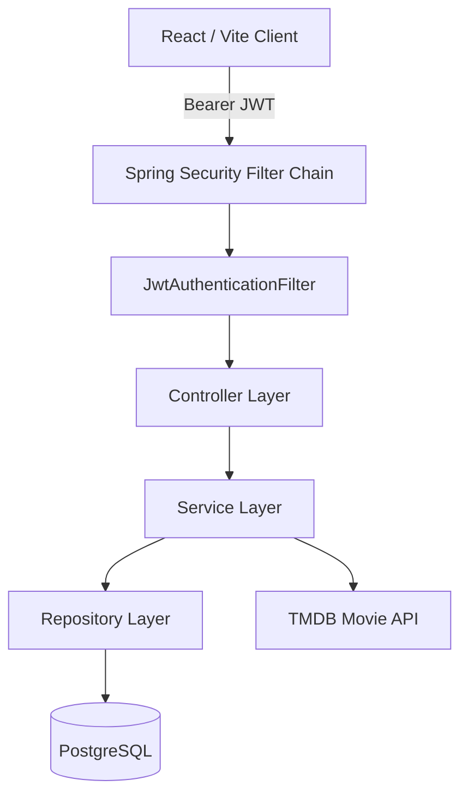
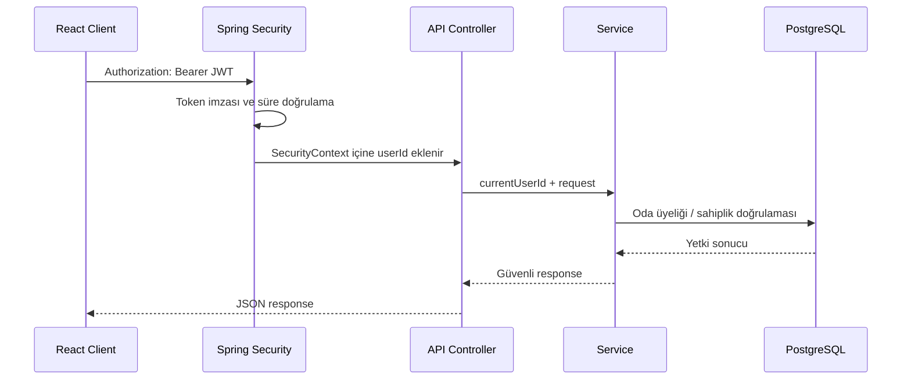

# DuoSpace — Ortak Film Listesi ve Oda Yönetim Sistemi

Spring Boot ve React ile geliştirilen, iki kullanıcının davet kodu üzerinden aynı odaya bağlanıp ortak film/oyun listesi yönetmesini sağlayan full-stack web uygulaması. Sistem JWT tabanlı kimlik doğrulama, oda üyeliği kontrolü, PostgreSQL kalıcılığı, TMDB film arama entegrasyonu ve Docker ile production paketleme içerir.

---

## Proje Genel Bakış

DuoSpace'te her kullanıcı kayıt olur ve giriş yaptıktan sonra bir oda oluşturabilir veya mevcut bir odaya davet koduyla katılabilir. Bir oda en fazla iki kullanıcı kabul eder. Ortak watchlist üzerinde film veya oyun ekleme, listeleme, izleme durumunu güncelleme ve silme işlemleri yalnızca odaya üye kullanıcılar tarafından yapılabilir.

Film arama isteği tarayıcıdan doğrudan TMDB'ye gitmez. React istemcisi kendi Spring Boot API'sine çağrı yapar; Spring Boot da TMDB API ile iletişim kurar. Böylece TMDB erişim tokenı frontend bundle'ında veya tarayıcıda bulunmaz.

---

## Proje Dosya Mimarisi ve Klasör Yapısı

```text
.
├── .mvn/                                  # Maven Wrapper dosyaları
├── frontend/                              # React 19 + Vite frontend uygulaması
│   ├── src/
│   │   ├── api/
│   │   │   └── client.js                  # Merkezi fetch client ve API hata modeli
│   │   ├── components/                    # Auth, oda, watchlist ve dialog bileşenleri
│   │   ├── hooks/
│   │   │   └── useDuoSpace.js             # Oturum, oda ve watchlist state akışı
│   │   ├── utils/
│   │   │   └── storage.js                 # sessionStorage token/oda yönetimi
│   │   ├── App.jsx                        # Ana ekran bileşimi
│   │   ├── main.jsx                       # React uygulama giriş noktası
│   │   └── styles.css                     # Uygulama stilleri
│   ├── index.html                         # Vite HTML giriş noktası
│   ├── package.json                       # Frontend bağımlılıkları ve scriptler
│   └── vite.config.js                     # Vite dev proxy ayarı
├── src/
│   ├── main/
│   │   ├── java/com/aydog4nn/manitimleproje/
│   │   │   ├── config/                    # Spring Security, JWT, Swagger, TMDB config
│   │   │   ├── controller/                # REST API controller sınıfları
│   │   │   ├── dto/                       # Request ve response modelleri
│   │   │   ├── entity/                    # JPA entity ve enum sınıfları
│   │   │   ├── exception/                 # Custom exception ve global handler
│   │   │   ├── repository/                # Spring Data JPA repository arayüzleri
│   │   │   └── service/
│   │   │       ├── abs/                   # Service interface'leri
│   │   │       └── impl/                  # İş kurallarının implementasyonları
│   │   └── resources/
│   │       ├── application.properties     # Spring Boot environment ayarları
│   │       └── db/migration/              # Flyway SQL migration dosyaları
│   └── test/                              # Unit ve Spring context testleri
├── .env.example                           # TMDB token örneği
├── compose.yaml                           # API + PostgreSQL orkestrasyonu
├── Dockerfile                             # React build + Spring package + JRE runtime
├── pom.xml                                # Maven bağımlılık ve build tanımları
└── README.md                              # Ana teknik proje dokümanı
```

---

## Sistem Mimarisi



### Katman Sorumlulukları

| Katman | Sorumluluk |
| :--- | :--- |
| React Components | Ekran parçaları, form state'i ve kullanıcı etkileşimi |
| `useDuoSpace` Hook | Oturum, aktif oda, watchlist ve API sonrası state yenileme |
| `api/client.js` | Tek noktadan HTTP çağrısı, Authorization header ve API hata dönüşümü |
| Controller | HTTP endpoint, request validation ve response status yönetimi |
| Service | Oda kapasitesi, üyelik, sahiplik ve watchlist iş kuralları |
| Repository | PostgreSQL üzerinde JPA tabanlı veri erişimi |
| Flyway | Veritabanı şemasının versiyonlu migration yönetimi |

---

## Kimlik Doğrulama ve Oda Bazlı Yetkilendirme

Sistemde global rol hiyerarşisi yerine oda sahipliği ve oda üyeliği modeli kullanılır. Kullanıcıların kimliği JWT token içindeki kullanıcı UUID'sinden çözülür; `ownerId` veya `addedById` gibi güvenlik açısından kritik alanlar frontend tarafından gönderilmez.



### Güvenlik Kuralları

- Şifreler veritabanında BCrypt hash olarak saklanır.
- API stateless'tir; form login, HTTP Basic ve server-side session kullanılmaz.
- `JwtAuthenticationFilter`, geçerli token içinden kullanıcı UUID'sini çözerek `SecurityContext`e yazar.
- `/api/v1/auth/**`, frontend static dosyaları ve Swagger hariç tüm endpointler JWT ister.
- Oda bilgisi ve watchlist işlemlerinde kullanıcının odaya üye olduğu doğrulanır.
- Oda güncelleme ve silme işlemlerini sadece oda sahibi yapabilir.
- React access tokenı `localStorage` yerine `sessionStorage`da tutar; tarayıcı sekmesi kapanınca silinir.
- TMDB tokenı backend environment variable'ı olarak tutulur; istemciye gönderilmez.
- CSP, `Referrer-Policy` ve frame embedding engeli HTTP security header'larıyla uygulanır.

### Route Güvenlik Matrisi

| Route | Erişim |
| :--- | :--- |
| `/`, `/assets/**` | Public |
| `/api/v1/auth/register`, `/api/v1/auth/login` | Public |
| `/swagger-ui/**`, `/v3/api-docs/**` | Public |
| `/api/v1/rooms/**` | Bearer JWT + oda üyeliği/sahipliği kontrolü |
| `/api/v1/movies/search` | Bearer JWT |

---

## Veri Modeli ve İş Kuralları

```text
users
 ├── id (UUID, PK)
 ├── username (UNIQUE)
 ├── email (UNIQUE)
 └── password_hash

rooms
 ├── id (UUID, PK)
 ├── name
 ├── invite_code (UNIQUE)
 └── owner_id -> users.id

room_members
 ├── room_id -> rooms.id
 ├── user_id -> users.id
 └── role: OWNER | MEMBER

watchlist_items
 ├── room_id -> rooms.id
 ├── added_by_id -> users.id
 ├── title
 ├── source_url
 └── status: PLANNED | WATCHING | COMPLETED
```

- `users.username` ve `users.email` benzersizdir.
- `rooms.invite_code` benzersizdir ve ikinci kullanıcının odaya katılması için kullanılır.
- `room_members` tablosunda `(room_id, user_id)` unique constraint'i aynı kullanıcının odaya iki kez eklenmesini engeller.
- Bir odanın iki kullanıcı sınırı service katmanında kontrol edilir.
- Oda silindiğinde room member ve watchlist kayıtları `ON DELETE CASCADE` ile temizlenir.
- Hibernate şema üretmez; `spring.jpa.hibernate.ddl-auto=validate` ile Flyway tarafından oluşturulan şemayı doğrular.

---

## API Uç Noktaları

### 1. Authentication API

Ana dizin: `/api/v1/auth`

| Uç Nokta | Metot | Açıklama | Yetki |
| :--- | :--- | :--- | :--- |
| `/register` | POST | Kullanıcı oluşturur, parolayı BCrypt ile saklar | Public |
| `/login` | POST | Kullanıcı girişini doğrular ve access token döner | Public |

Kayıt payload kuralları: `username` 3-50, `email` en fazla 255, `password` 8-72 karakterdir.

```json
POST /api/v1/auth/login
{
  "email": "user@example.com",
  "password": "example-password"
}
```

### 2. Room API

Ana dizin: `/api/v1/rooms`

| Uç Nokta | Metot | Açıklama | Oda Kuralı |
| :--- | :--- | :--- | :--- |
| `/` | POST | Yeni oda oluşturur | Token sahibi otomatik owner olur |
| `/join` | POST | Davet koduyla odaya katılır | Oda dolu olmamalı, tekrar üyelik olmamalı |
| `/` | GET | Aktif kullanıcının odalarını listeler | Sadece üye olunan odalar döner |
| `/{roomId}` | GET | Oda bilgisi getirir | Sadece oda üyesi okuyabilir |
| `/{roomId}` | PUT | Oda adını günceller | Sadece owner günceller |
| `/{roomId}` | DELETE | Odayı siler | Sadece owner silebilir |

```json
POST /api/v1/rooms
{
  "name": "Hafta sonu listesi"
}
```

### 3. Watchlist API

Ana dizin: `/api/v1/rooms/{roomId}/watchlist`

| Uç Nokta | Metot | Açıklama | Oda Kuralı |
| :--- | :--- | :--- | :--- |
| `/` | POST | Listeye seçim ekler | Sadece oda üyesi |
| `/` | GET | Ortak listeyi getirir | Sadece oda üyesi |
| `/{itemId}` | PUT | Başlık, link veya durumu günceller | Sadece oda üyesi |
| `/{itemId}` | DELETE | Seçimi siler | Sadece oda üyesi |

```json
POST /api/v1/rooms/{roomId}/watchlist
{
  "title": "Arrival",
  "sourceUrl": "https://www.themoviedb.org/movie/329865"
}
```

### 4. Movie Catalog API

Ana dizin: `/api/v1/movies`

| Uç Nokta | Metot | Açıklama | Yetki |
| :--- | :--- | :--- | :--- |
| `/search?query={query}` | GET | TMDB üzerinden en fazla 10 film sonucu döner | Bearer JWT |

`query` parametresi 2-100 karakter olmalıdır. Response içindeki `tmdbId`, `title`, `releaseYear`, `posterUrl`, `overview` ve `voteAverage` alanları React film seçim ekranında kullanılır.

---

## Hata Response Standardı

`GlobalExceptionHandler`, domain hatalarını aşağıdaki ortak JSON formatında döner:

```json
{
  "message": "Bu işlem için yetkin yok."
}
```

| HTTP Kodu | Kullanım |
| :--- | :--- |
| `400` | Validation hatası |
| `401` | Hatalı kullanıcı bilgisi, geçersiz veya süresi dolmuş JWT |
| `403` | Sahiplik yetkisi olmayan işlem |
| `404` | Oda veya watchlist kaydı bulunamadı |
| `409` | Duplicate kullanıcı, tekrar üyelik veya dolu oda |
| `503` | TMDB dış servisine ulaşılamadı |

---

## React Frontend Mimarisi

Frontend React 19 ve Vite 7 ile yazılmıştır. Tek bir JavaScript dosyası yerine sorumluluklar ayrılmıştır:

| Dosya / Katman | Sorumluluk |
| :--- | :--- |
| `App.jsx` | Uygulama ekran akışı ve kullanıcı aksiyonlarını birleştirir |
| `components/AuthCard.jsx` | Login/register form state'i |
| `components/RoomSetup.jsx` | Oda oluşturma ve davet koduyla katılma |
| `components/Watchlist.jsx` | Watchlist görünümü, durum geçişi ve silme |
| `components/AddItemDialog.jsx` | TMDB arama ve manuel seçim ekleme |
| `hooks/useDuoSpace.js` | API çağrıları sonrası token, room ve item state'ini yeniler |
| `api/client.js` | JSON parse, Authorization header ve `ApiError` üretimi |

Vite development modunda `/api` isteklerini `localhost:8080` adresindeki Spring Boot uygulamasına proxy eder. Production ortamında React build çıktısı Spring Boot jar'ı içindeki static dosyalara kopyalanır; ayrı bir Node runtime gerekmez.

---

## Docker Paketleme ve Çalıştırma

`Dockerfile` üç aşamalı build kullanır:

1. `node:22-alpine`: React/Vite frontend build çıktısını üretir.
2. `eclipse-temurin:21-jdk`: Spring Boot jar'ını ve React static çıktısını paketler.
3. `eclipse-temurin:21-jre`: Sadece jar dosyasını non-root `spring` kullanıcısıyla çalıştırır.

Runtime image'a Node, Maven cache'i, frontend source dosyaları ve build araçları taşınmaz.

### Environment Variable'lar

| Variable | Açıklama |
| :--- | :--- |
| `DB_URL` | PostgreSQL JDBC URL |
| `DB_USERNAME` | PostgreSQL kullanıcı adı |
| `DB_PASSWORD` | PostgreSQL parolası |
| `JWT_SECRET` | Production access token signing secret'i |
| `JWT_ACCESS_TOKEN_EXPIRATION` | ISO-8601 süre, ör. `PT15M` |
| `TMDB_API_READ_ACCESS_TOKEN` | TMDB backend access tokenı |

### Docker Compose ile Çalıştırma

Önce `.env.example` dosyasını `.env` olarak kopyala ve TMDB tokenını ekle:

```bash
cp .env.example .env
docker compose up --build -d
```

| Adres | Açıklama |
| :--- | :--- |
| `http://localhost:8080` | React frontend ve Spring Boot API |
| `http://localhost:8080/swagger-ui/api-docs.html` | Swagger UI |
| `localhost:5432` | PostgreSQL |

```bash
docker compose down
```

---

## Testler

```bash
./mvnw test
```

| Test Sınıfı | Doğrulanan Davranış |
| :--- | :--- |
| `JwtServiceTest` | Üretilen token içinden doğru kullanıcı UUID'sinin çıkarılması |
| `RoomServiceImplTest` | Geçerli davet kodu, tekrar katılım engeli ve iki kişi oda limiti |
| `TmdbMovieCatalogServiceTest` | TMDB JSON alanlarının response DTO'suna dönüştürülmesi |
| `ManitimleProjeApplicationTests` | Spring context, Flyway migration ve PostgreSQL bağlantısı |

TMDB servis testi gerçek TMDB ağına ihtiyaç duymaz. Test içinde lokal HTTP server çalışır; bu sayede JSON mapping davranışı dış ağ veya DNS probleminden bağımsız doğrulanır.

---

## API Dokümantasyonu

Uygulama çalıştıktan sonra tüm endpointleri ve request/response şemalarını Swagger UI üzerinden inceleyebilirsin:

- `http://localhost:8080/swagger-ui/api-docs.html`

Korumalı endpointleri Swagger üzerinde denemek için önce `/api/v1/auth/login` endpointinden access token alıp **Authorize** alanına `Bearer <access-token>` formatında eklemek gerekir.
